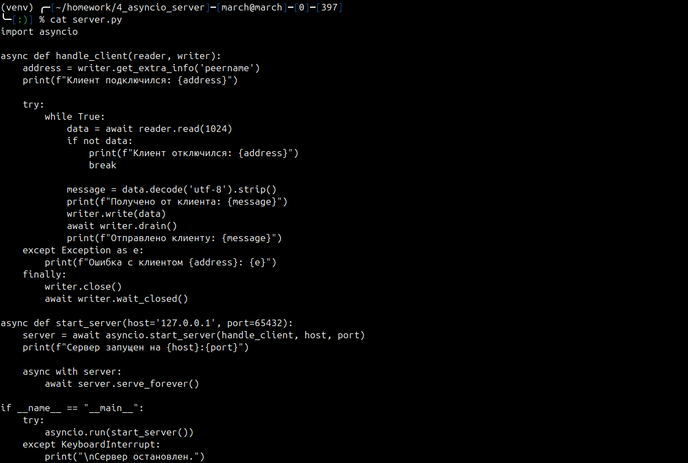
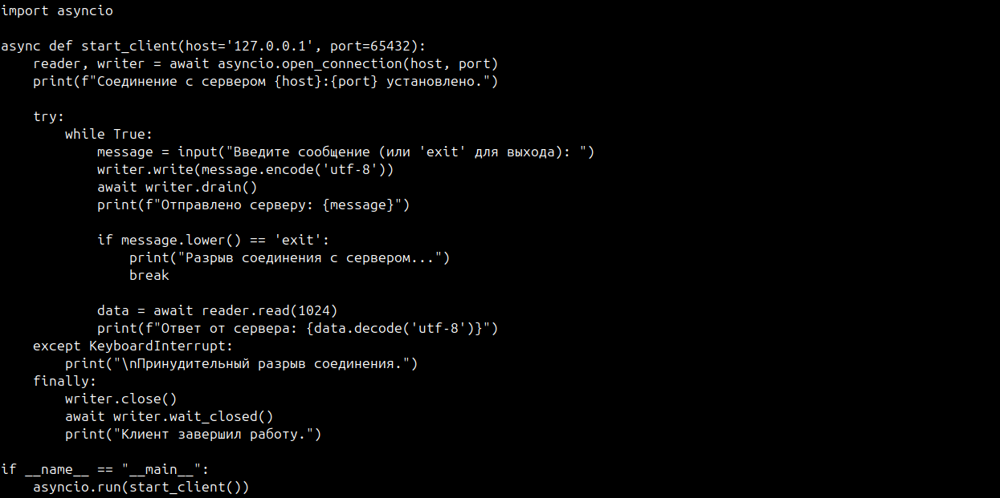
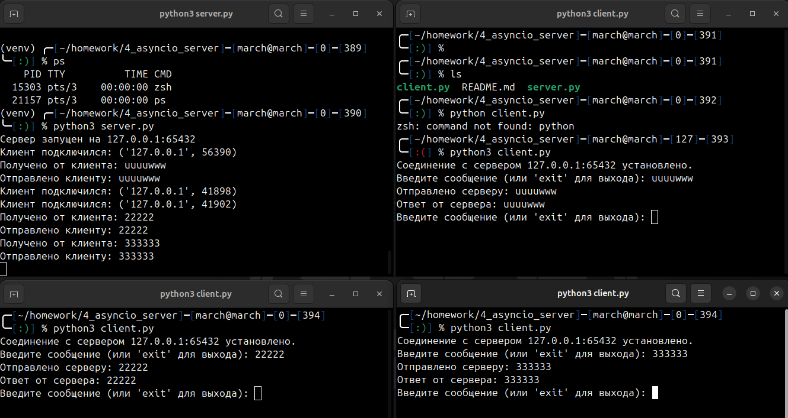

# Отчет по работе "Asyncio Server"

## Основное задание

Познакомиться с асинхронным выполнением процедур в Python при помощи asyncio
## Ход выполнения работы

Создан файл `server.py`, который обрабатывает подключения клиентов асинхронно. Для каждого клиента создается задача, которая обрабатывает его сообщения.

Создан файл `client.py`, который подключается к серверу и отправляет данные. 

Запустим сервер и попробуем подключить несколько клиентов к серверу:

